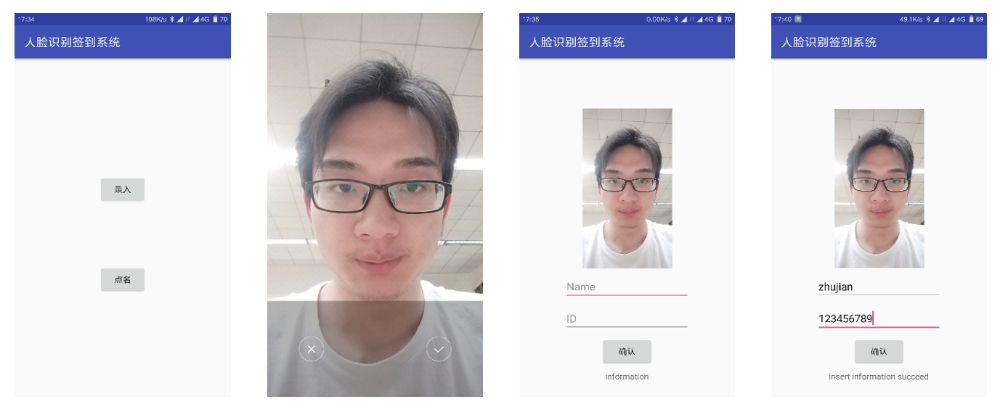
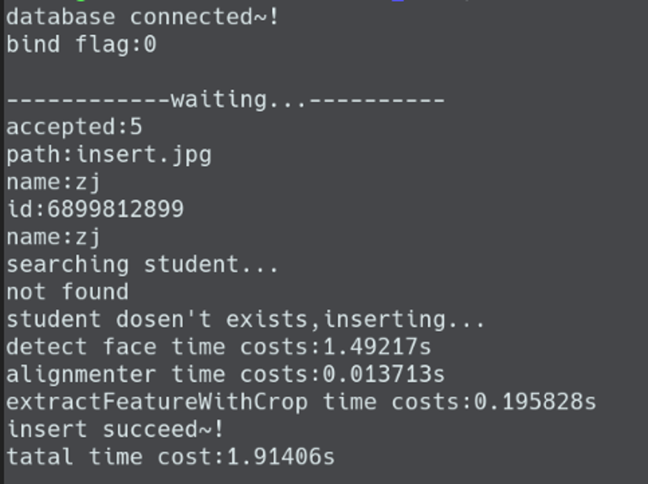
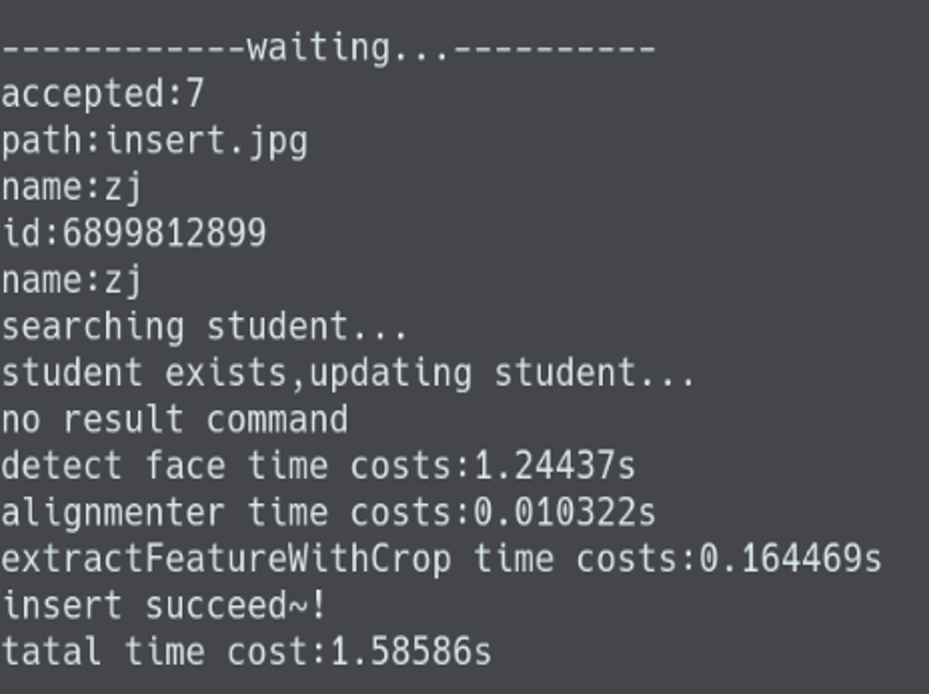
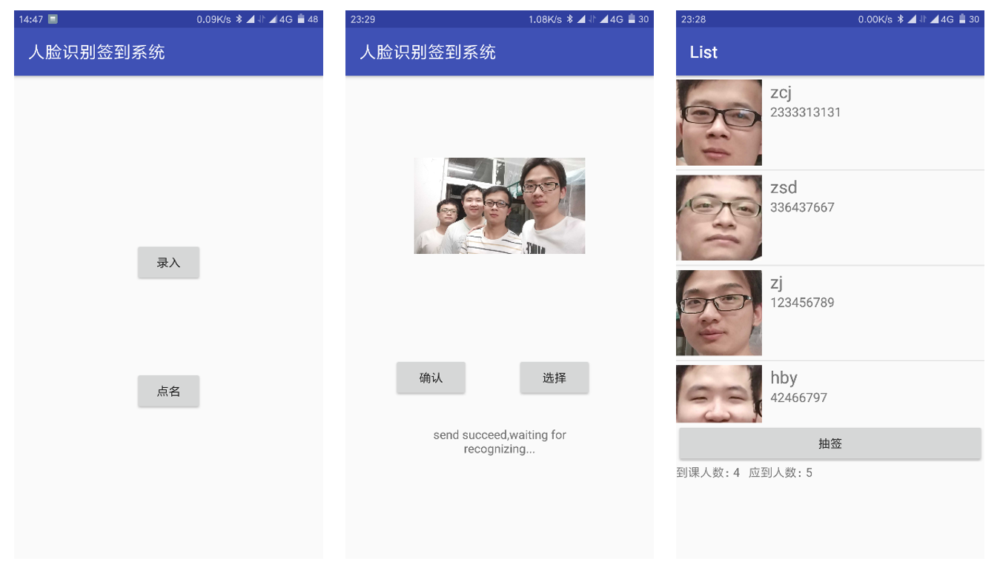
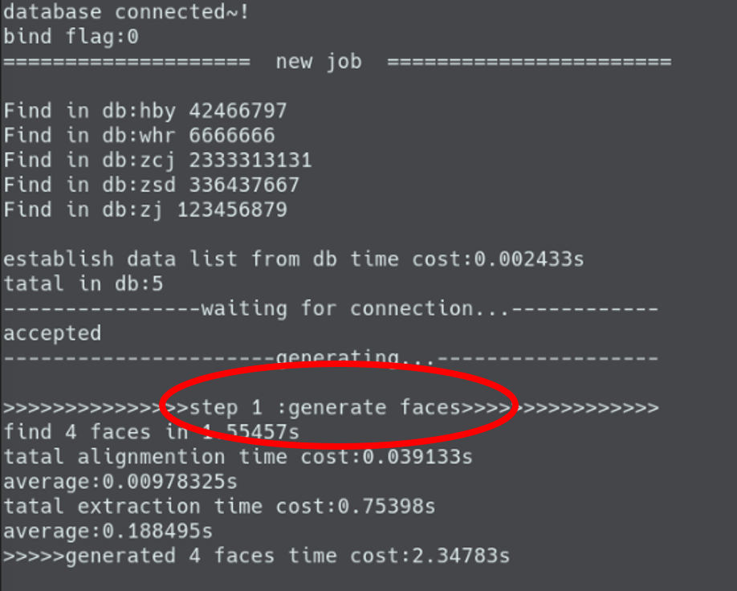
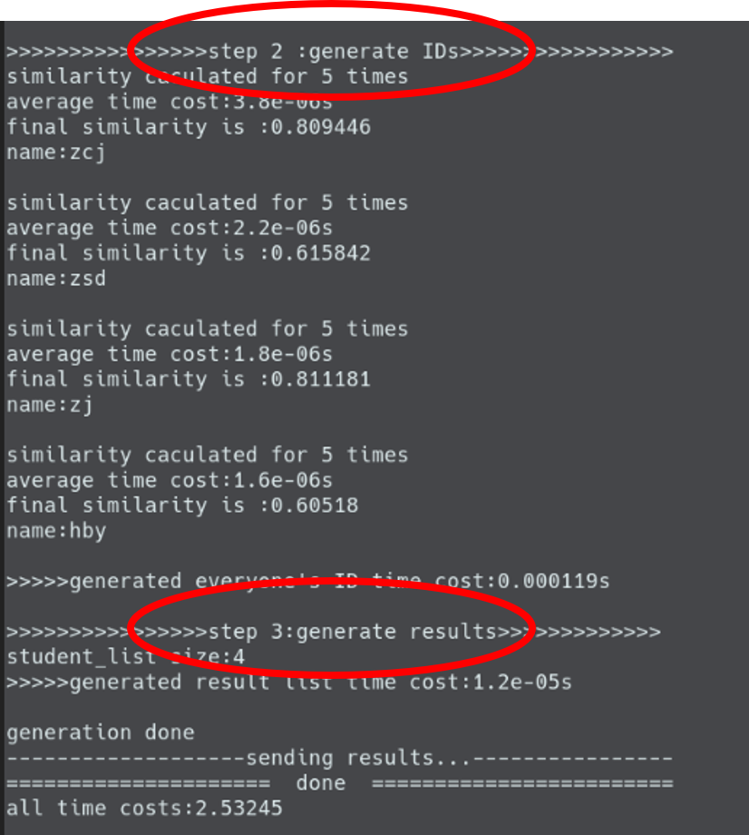
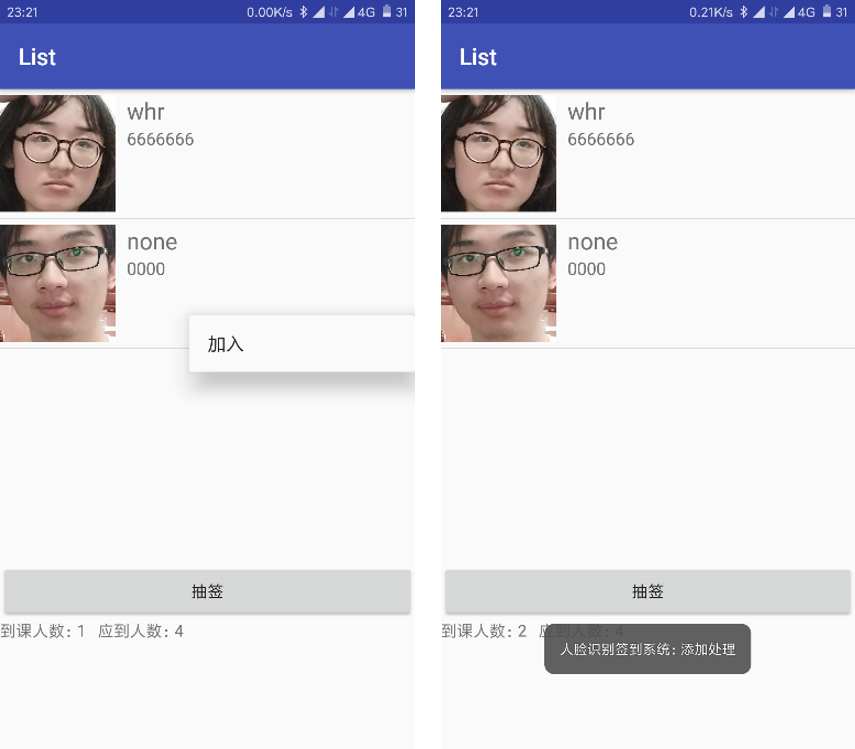
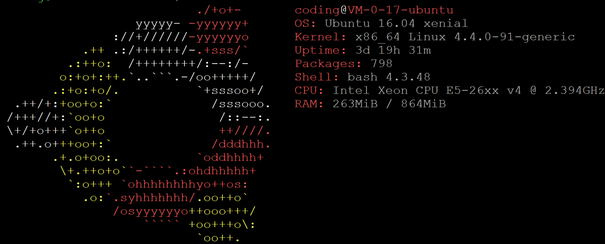
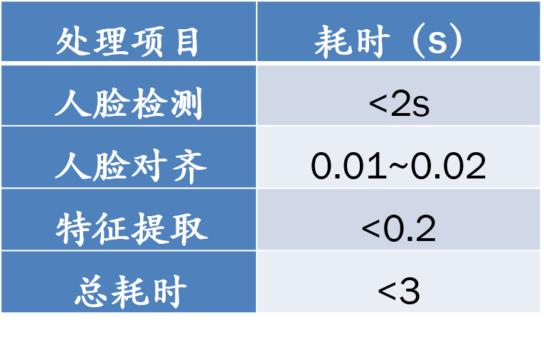
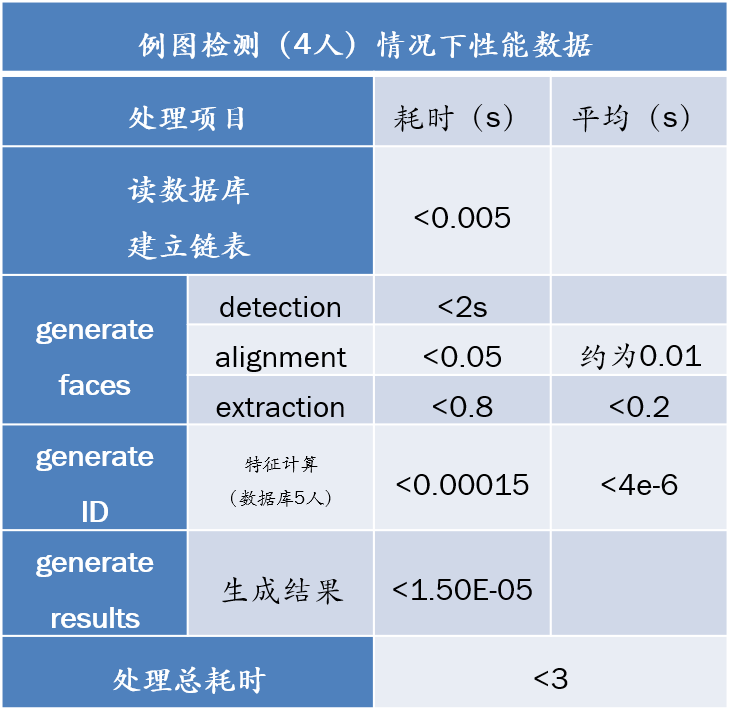

## 说明
    本程序封装了seetaFace人脸识别引擎,实现服务器+安卓app人脸签到系统。
    所有c++代码皆为服务器代码。app主要java源码在android_src文件夹中。
    本程序暂未实现多线程处理，仅供交流学习。

## 编译
* makeRecvfile.sh 编译recv程序。图像接收程序
* makeScan.sh 编译scan程序。图像检测程序
* makeToDB.sh 编译toDB程序。信息录入程序  
注：本程序采用Opencv3 若使用opencv2，需要去掉opencv_imgcodecs库

## 运行
* 运行前先source执行 `. loadENV.sh` 添加seetaFace动态库路径，或手动加入环境变量  

## 效果
* 录入 

若存在则自动更新

* 检测

* 从检测结果中添加

## 性能分析
* 运行环境

* 组件性能

* 系统性能

